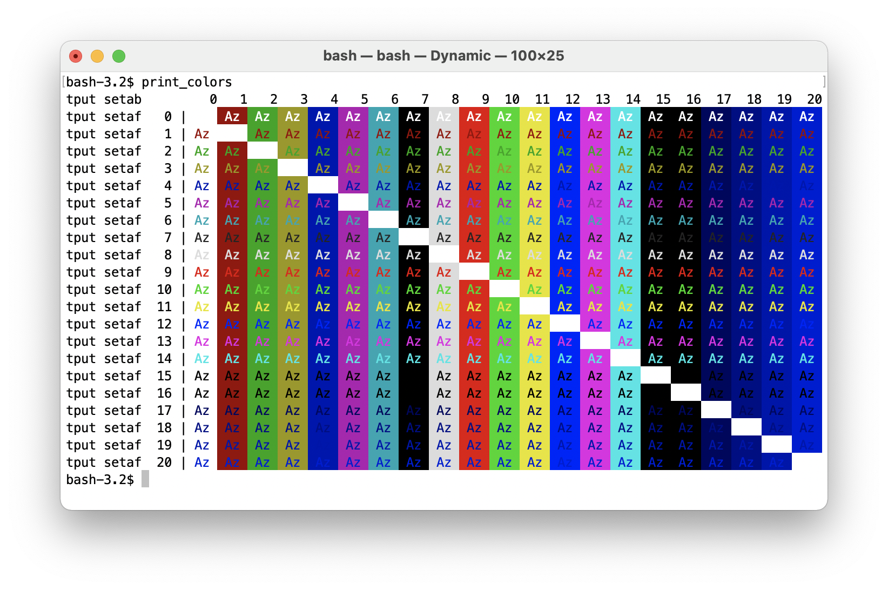
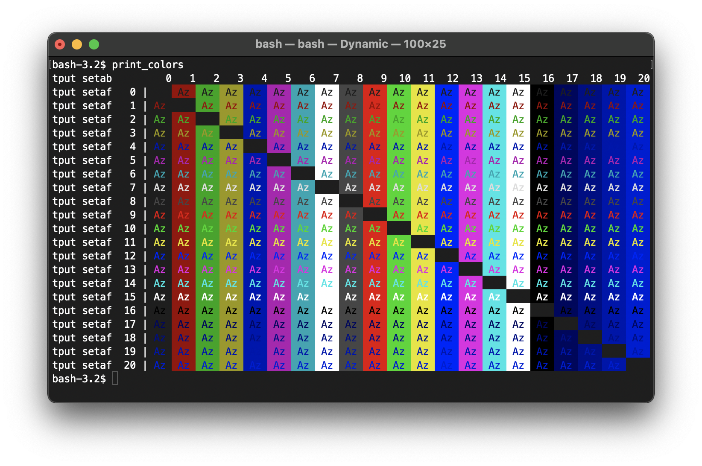

# Dynamic Terminal.app theme

 Light Mode                                                      | Dark Mode
:---------------------------------------------------------------:|:---------------------------------------------------------------:
  | 

## Installation

1. Download the `Dynamic.terminal` file in this folder to your mac.
1. Double click on it to open a new Terminal.app window using the `Dynamic` theme.
     - This will also add the `Dynamic` theme to the list of available Terminal.app themes.
1. Switch between light and dark modes on macOS to verify that the Terminal.app content does adapt.
1. Optionally define the `Dynamic` theme as default on the Terminal.app preferences.

You can do the first 2 steps with the following line in your terminal:

```bash
(cd ~/Downloads && curl -sSLO https://raw.githubusercontent.com/rbf/dotfiles/main/macOS/Dynamic.terminal && open Dynamic.terminal)
```
